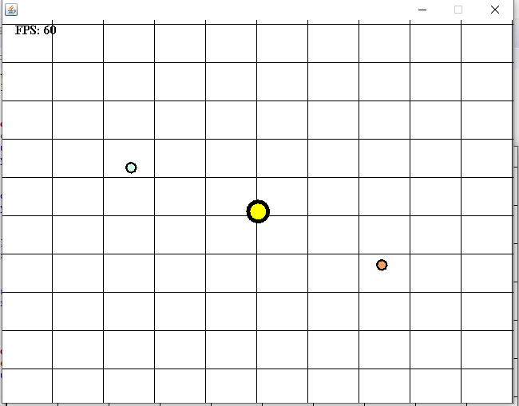
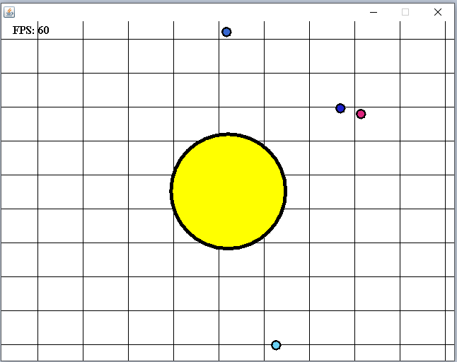

# JavaAgar

A remake of the popular game Agar.io written in Java using Java AWT and Swing. The game is rendered and updated 60 times a second in a thread seperate from the main thread which handles the window.

The game involves a cirlce in the center which the user controls with WASD keys. The user can move the circle around the map to collect paricles which increases the size of the player's cirle.

This game is still in the early iteration. Future updates could be: Server connection for multiplayer, mouse control, menu, saving game, scoring.